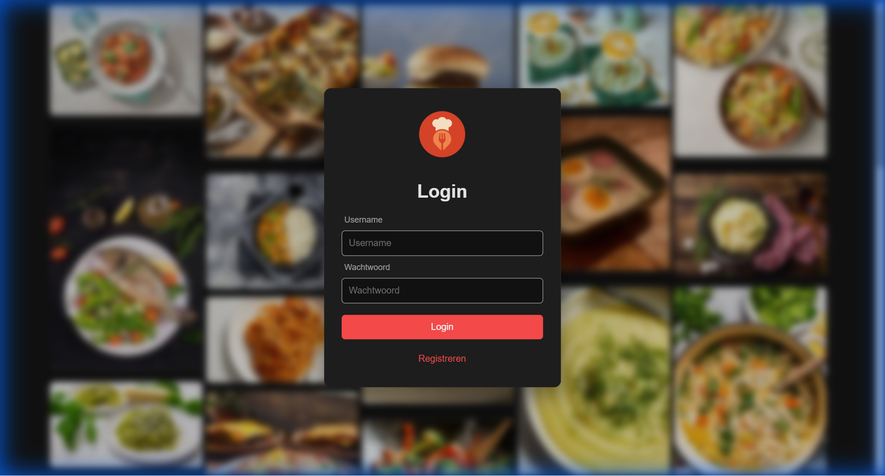
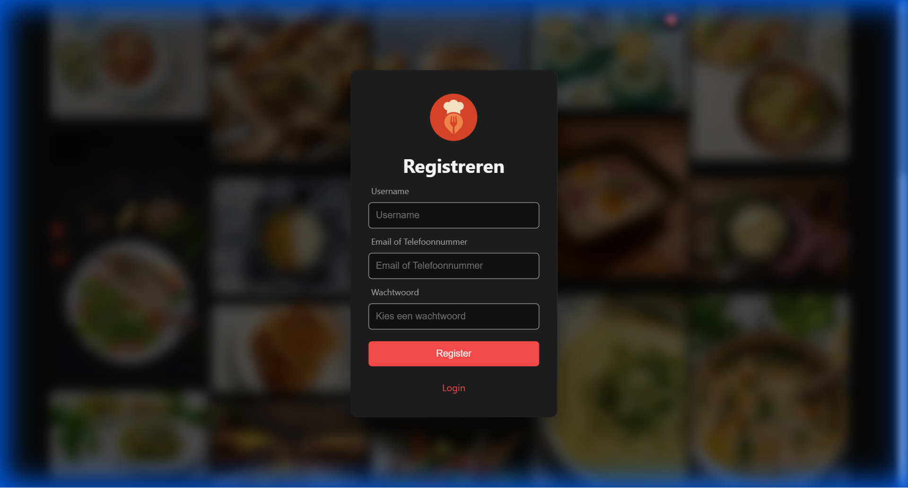
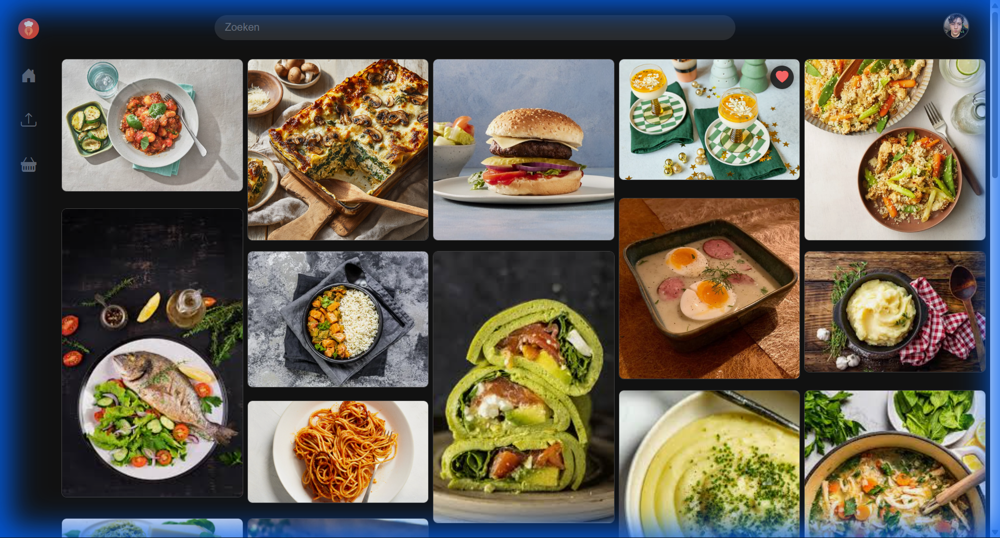
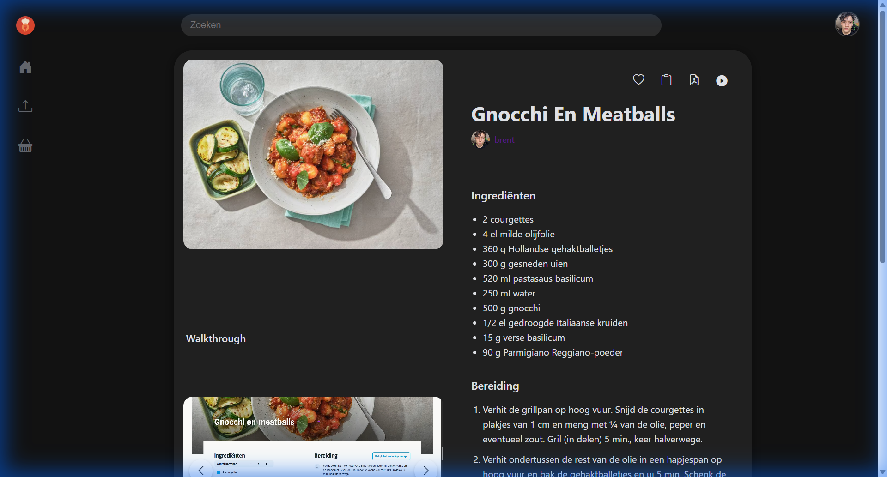
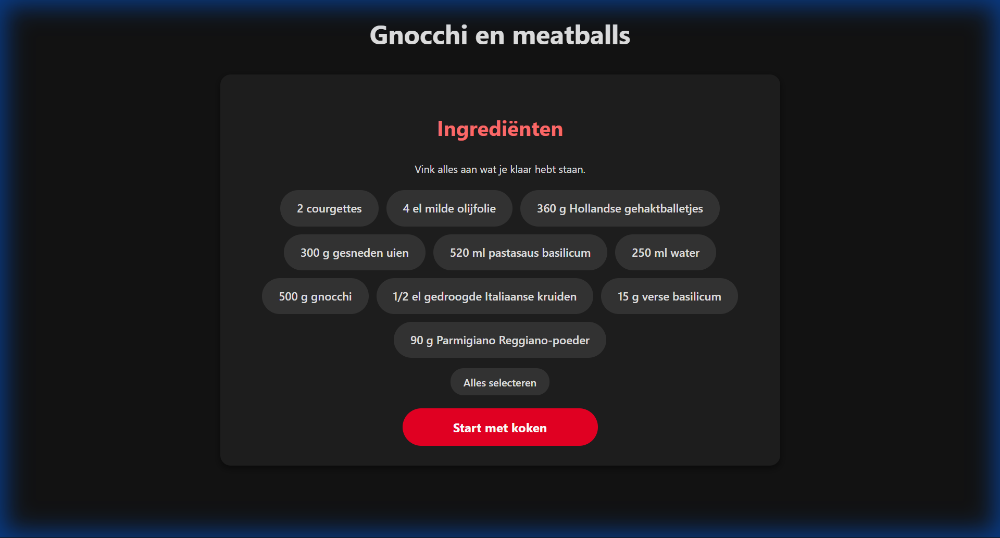
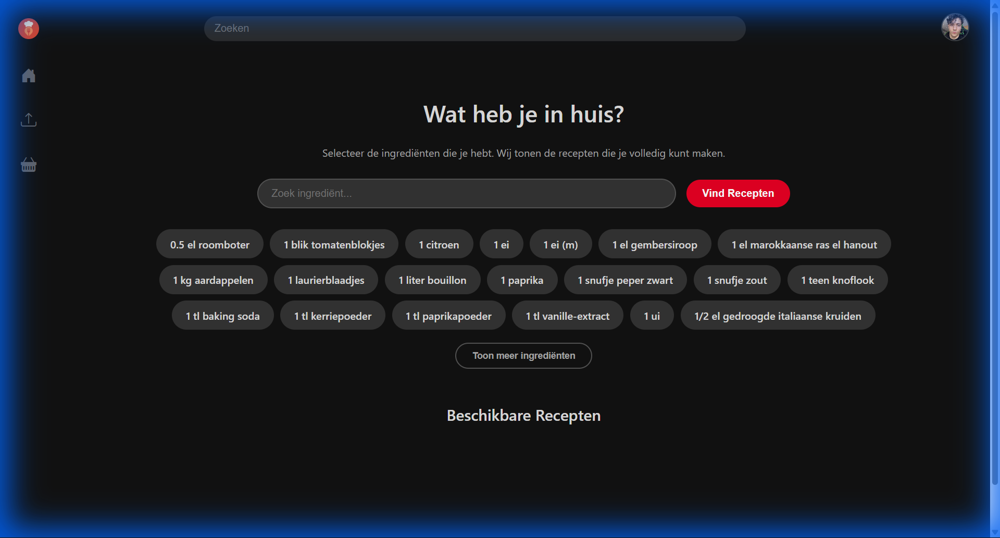
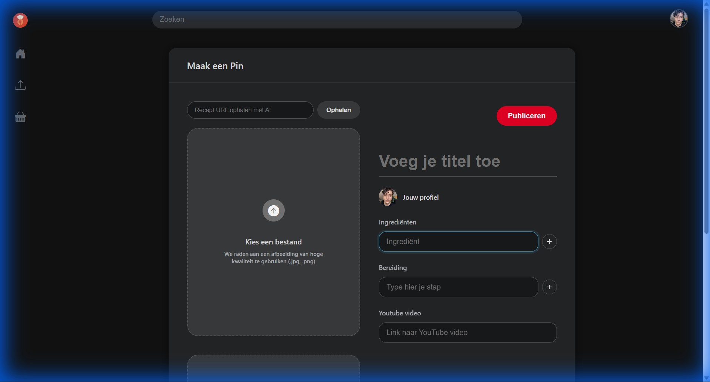
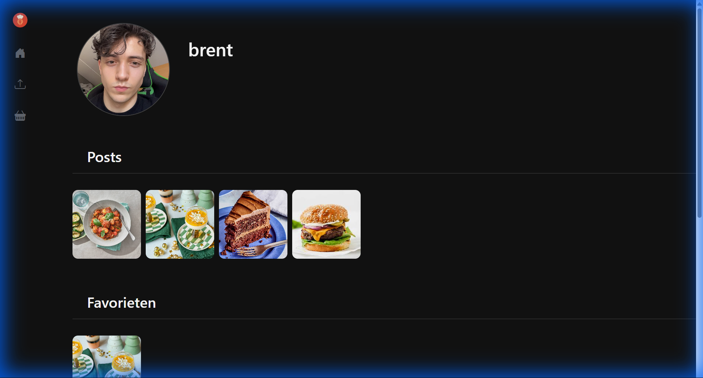

# Web programming project skeleton

A skeleton that provides some of the basics to get starting with the web programming project.

This README is part of your submission. Make sure it is clear and contains the required information. There is no template. [A guide for Markdown.](https://www.markdownguide.org/)

## Structure

- `app.js`: web server entrypoint
- `db.js`: database entrypoint
- `public/`: folder with static resources

## Included

**Bootstrap**

- https://getbootstrap.com/
  - `<link rel="stylesheet" href="css/bootstrap.css">`
  - ``
- https://icons.getbootstrap.com/
  - `<link rel="stylesheet" href="css/bootstrap-icons.css">`

**Express**

- https://expressjs.com/
- https://express-validator.github.io/docs/next/
- https://ejs.co/
- https://github.com/WiseLibs/better-sqlite3/

## Local development

install: `npm install`
run: `node app.js`

## Deployment

build: `docker build . -t webprogramming/project`
run: `docker run -it -p 8080:80 webprogramming/project`

## Notes on your submission

- Submit a `groepX_wepr_Naam1_Naam2.zip` in the same structure as you've received this skeleton. This file should be in the root, and all commands should run from the root.
- Don't forget to test the Docker deployment, this is how your project will be evaluated. (Also test from scratch, i.e., how the staff receives it.)
- Make sure there is example data, and it should load with the Docker deployment.
- The README should contain any important information on your project:
  - Login credentials.
  - (Un)Realized requirements and expansions.
  - A statement on AI usage.
- You can include any relevant optional artefacts, e.g., mockups, diagrams, task distribution, timesheets.
- Don't include unnecessary files, e.g., `.git` or `node_modules`.

## Project Documentatie

Hieronder vind je een overzicht van de belangrijkste pagina's en functionaliteiten van de applicatie.

### Testgebruikers
*   **Gebruiker:** `brent`
*   **Wachtwoord:** `brent`

### Applicatie Overzicht

#### 1. Login & Registratie
De applicatie is beveiligd. Gebruikers moeten inloggen om toegang te krijgen tot de volledige functionaliteit.

*(Login scherm waar gebruikers hun gegevens invoeren)*

Voor nieuwe gebruikers is er een registratiepagina.

#### 2. Homepagina
Op de homepagina zie je een overzicht van de laatste recepten in een masonry grid layout.

#### 3. Recept Details
Klik op een recept om de details te bekijken, inclusief ingrediënten, stappen en media (foto's en video's).

#### 4. Volg Mee Modus
Een speciale modus om stapsgewijs het recept te volgen, ideaal voor tijdens het koken.

#### 5. Mijn Ingrediënten
Zoek recepten op basis van ingrediënten die je al in huis hebt.

#### 6. Uploaden
Deel je eigen creaties via de upload pagina. Hier kun je afbeeldingen en video's toevoegen.

#### 7. Profiel
Beheer je eigen profiel en bekijk je eigen posts.

### Artefacten
Alle screenshots zijn te vinden in de map `docs/screenshots`. Eventuele schetsen of diagrammen kunnen hier ook aan toegevoegd worden.

## Externe API's
De applicatie maakt gebruik van diverse externe services en bibliotheken:

*   **OpenAI API:** Wordt gebruikt om recepten te extraheren en structureren van externe websites (via de `/api/fetchrecipe` endpoint).
*   **SendGrid:** Verzorgt het versturen van e-mails, bijvoorbeeld voor 2FA verificatiecodes.
*   **Twilio:** Wordt gebruikt voor het versturen van SMS-berichten bij 2FA (indien ingesteld).
*   **Google Fonts:** Voor de typografie van de website.
*   **Bootstrap Icons:** Voor alle iconen in de interface via CDN.
*   **html2pdf.js:** Een externe library die intern `html2canvas` gebruikt om recepten op te slaan als PDF.

## Browser API's
We hebben gebruik gemaakt van de volgende browser API's om de gebruikerservaring te verbeteren:

1.  **Fetch API**
    *   Gebruikt voor het asynchroon togglen van favorieten zonder de pagina te herladen (`post.js`).
    *   Gebruikt in de upload flow om receptdata op te halen via onze eigen backend proxy (`upload.js`).

2.  **Clipboard API**
    *   Hiermee kunnen gebruikers met één klik de volledige recepttekst (ingrediënten + stappen) kopiëren naar hun klembord (`post.js`).

3.  **Browser Storage (LocalStorage)**
    *   Wordt gebruikt om de voorkeur voor 'Dark Mode' op te slaan, zodat deze bewaard blijft bij het herladen van de pagina of navigeren (`post.js`).
